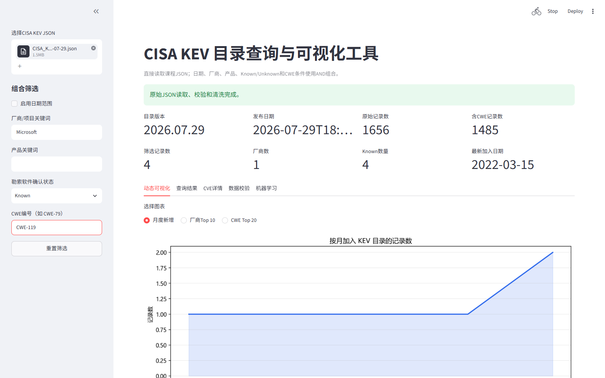

# CISA KEV 目录分析与查询系统

基于课程冻结快照 `CISA_KEV_2026-07-29.json` 的可复现分析项目，覆盖数据读取与校验、
统计分析、CWE多标签分析、组合查询、Streamlit GUI、结果导出和TF-IDF + KMeans文本聚类。

项目已集成三名成员的实现，当前契约版本为 `1.0.0`。公共字段、函数签名、统计分母、
排序规则和输出格式以 `FREEZE_MANIFEST.md`、`docs/` 与 `contracts/` 中的冻结契约为准。

## 项目能力

| 模块 | 主要能力 |
|---|---|
| 数据底座 | 读取原始JSON；校验顶层结构、1,656条记录、11个字段、CVE、日期、状态和CWE |
| 数据准备 | 保留全部原始字段；追加厂商/产品清洗、年份、月份、期限和CWE辅助字段 |
| 统计分析 | 月度与年度、处置期限、Known/Unknown、厂商产品、CR5/CR10/HHI |
| CWE分析 | 多标签展开、CVE-CWE去重、总体及Known/Unknown子集统计 |
| 组合查询 | 日期、厂商、Known/Unknown和CWE按AND组合；导出三组可复现查询案例 |
| GUI | 原始JSON上传、组合筛选、动态图、结果表、CVE详情、校验结果和CSV/PNG下载 |
| 机器学习 | TF-IDF文本特征、候选k比较、KMeans聚类、关键词、代表CVE和二维展示 |
| 可复现输出 | CSV、JSON、PNG、HTML和运行manifest；记录输入与产物哈希 |

## 数据与运行环境

- Python：3.11至3.13
- 冻结数据：`CISA_KEV_2026-07-29.json`
- 目录版本：`2026.07.29`
- 记录数：1,656
- 默认随机种子：`20260806`

将课程JSON放在：

```text
data/CISA_KEV_2026-07-29.json
```

原始数据受 `.gitignore` 保护，不应提交到仓库。流水线只读输入文件，不会覆盖原始JSON。

## 快速开始

### Windows PowerShell

```powershell
python -m venv .venv
.\.venv\Scripts\python.exe -m pip install --upgrade pip
.\.venv\Scripts\python.exe -m pip install -r requirements.txt
.\.venv\Scripts\python.exe main.py
```

### macOS / Linux

```bash
python3 -m venv .venv
.venv/bin/python -m pip install --upgrade pip
.venv/bin/python -m pip install -r requirements.txt
.venv/bin/python main.py
```

默认命令依次执行加载、校验、清洗、必做分析、三组查询、机器学习和正式导出。成功时终端会
显示 `Pipeline status=complete`，产物写入 `outputs/`。

## 命令行用法

完整运行：

```powershell
.\.venv\Scripts\python.exe main.py
```

跳过机器学习：

```powershell
.\.venv\Scripts\python.exe main.py --skip-ml
```

只运行数据底座阶段：

```powershell
.\.venv\Scripts\python.exe main.py --data-core
```

指定输入和输出路径：

```powershell
.\.venv\Scripts\python.exe main.py `
  --input data\CISA_KEV_2026-07-29.json `
  --output outputs
```

检查题目指定函数签名：

```powershell
.\.venv\Scripts\python.exe main.py --check-contracts
```

macOS和Linux将解释器路径替换为 `.venv/bin/python`，并使用平台对应的路径分隔符即可。

## 启动GUI

机器学习页面读取 `outputs/ml/` 中的正式结果，因此建议先运行一次完整流水线，再启动：

```powershell
.\.venv\Scripts\python.exe -m streamlit run app.py
```

打开页面后上传课程JSON。GUI将重新执行读取、校验和清洗，并提供：

- 日期、厂商、产品、Known/Unknown和CWE组合筛选；
- 筛选记录数、厂商数、Known数量和最新加入日期；
- 月度新增、厂商Top 10和CWE Top 20动态图；
- 查询结果表、单条CVE详情与输入校验结果；
- 当前筛选结果CSV和当前图表PNG下载；
- 预生成的聚类指标、二维图、关键词和代表CVE。



完整演示截图及拍摄说明见 `screenshots/README.md`。

## 输出目录

`outputs/` 是程序生成目录，不应手工编辑。具体文件名、列顺序、编码和排序由
`contracts/output_registry.yaml` 统一定义。

| 目录 | 内容示例 |
|---|---|
| `outputs/validation/` | 元数据、校验摘要、问题明细和字段画像 |
| `outputs/prepared/` | 保留原始字段并追加衍生字段的prepared数据 |
| `outputs/tables/` | 时间、期限、勒索状态、厂商产品和CWE统计表 |
| `outputs/queries/` | 查询案例摘要及三组实际查询结果 |
| `outputs/figures/` | 月度、期限、状态、厂商和CWE静态图 |
| `outputs/html/` | 厂商-产品交互式矩形树图 |
| `outputs/ml/` | 聚类选择、摘要、关键词、记录和二维图 |
| `outputs/manifests/` | 运行状态、环境、输入SHA-256和产物元数据 |

CSV统一使用 `utf-8-sig`，日期格式为 `YYYY-MM-DD`，比例保存为0到1的小数。`cwes` 在
内存中保持 `list[str]`，导出CSV时序列化为紧凑JSON数组字符串。

## 代码结构

```text
.
├─ app.py                       # Streamlit GUI
├─ main.py                      # 命令行与流水线入口
├─ src/kev_analysis/
│  ├─ loader.py                 # JSON读取
│  ├─ validator.py              # 数据质量校验
│  ├─ cleaner.py                # prepared DataFrame
│  ├─ time_analysis.py          # 时间分布
│  ├─ deadline_analysis.py      # 处置期限
│  ├─ ransomware_analysis.py    # Known/Unknown
│  ├─ vendor_analysis.py        # 厂商、产品与集中度
│  ├─ cwe_analysis.py           # CWE多标签分析
│  ├─ query.py                  # 核心及GUI扩展查询
│  ├─ query_cases.py            # 三组可复现案例
│  ├─ ml_analysis.py            # TF-IDF + KMeans
│  ├─ gui_service.py            # GUI动态统计服务
│  ├─ visualization.py          # 公共图表
│  ├─ exporters.py              # 契约化导出
│  └─ pipeline.py               # 全流程编排
├─ contracts/                   # 机器可读输出与负责人契约
├─ config/                      # 默认配置
├─ docs/                        # 架构、接口、错误、测试和协作文档
├─ schemas/                     # 原始与prepared数据Schema
├─ tests/                       # 单元、契约、流水线与GUI测试
├─ report/                      # 报告章节文稿
├─ ppt/                         # PPT逐页内容与讲稿
└─ screenshots/                 # GUI答辩截图
```

## 核心数据流

```text
原始JSON
  -> Loader读取
  -> Validator校验
  -> Cleaner生成prepared DataFrame
  -> 统计/CWE/查询/机器学习分析
  -> Exporter按注册表导出
  -> run_manifest记录可复现信息
```

GUI复用相同的Loader、Validator、Cleaner和查询函数，不维护另一套独立业务逻辑。严重校验
问题会阻止正式分析；合法的空查询结果保留完整列结构，不作为异常处理。

## 关键接口

题目指定查询函数签名保持冻结：

```python
filter_kev(
    df,
    start_date=None,
    end_date=None,
    vendor=None,
    ransomware=None,
    cwe=None,
) -> tuple[pd.DataFrame, QuerySummary]
```

- 日期作用于 `dateAdded` 闭区间；
- 厂商使用不区分大小写的字面子串匹配；
- `ransomware` 只接受 `Known`、`Unknown` 或 `None`；
- CWE规范化后在列表成员中精确匹配；
- 多条件按AND组合；
- 结果按 `dateAdded DESC, cveID ASC` 稳定排序；
- GUI产品筛选由 `filter_kev_extended` 包装器提供。

其他公共接口与异常语义见 `docs/interface-contract.md` 和 `docs/error-contract.md`。

## 测试与质量检查

安装 `requirements.txt` 后运行：

```powershell
.\.venv\Scripts\python.exe scripts\verify_freeze.py
.\.venv\Scripts\python.exe -m pytest tests -q
.\.venv\Scripts\python.exe -m ruff check src tests main.py app.py scripts
.\.venv\Scripts\python.exe -m mypy src
.\.venv\Scripts\python.exe main.py --check-contracts
```

也可以在激活虚拟环境后执行仓库脚本：

```powershell
.\.venv\Scripts\Activate.ps1
.\scripts\check.ps1
```

```bash
source .venv/bin/activate
./scripts/check.sh
```

测试覆盖输入校验、字段保留、统计守恒、稳定排序、CWE展开、组合查询、导出契约、机器学习、
完整流水线和GUI启动。

## 报告、PPT文稿与截图

- 报告总骨架：`report/REPORT_OUTLINE.md`
- 成员二统计与机器学习文稿：`report/member2-statistical-analysis.md`
- 成员三CWE、查询与GUI文稿：`report/member3-cwe-query-gui.md`
- PPT总骨架：`ppt/PPT_OUTLINE.md`
- 成员二PPT讲稿：`ppt/member2-slide-content.md`
- 成员三PPT讲稿：`ppt/member3-slide-content.md`
- GUI截图清单：`screenshots/README.md`

报告和PPT中的数字必须读取 `outputs/` 正式产物，不得手工重新计算。图表应注明数据源文件名，
提交前按 `docs/checklists/final-delivery-checklist.md` 验收。

## 成员分工

- 成员一：数据加载、校验、清洗、导出、流水线、契约、测试与最终集成；
- 成员二：时间、期限、勒索状态、厂商产品、集中度及机器学习；
- 成员三：CWE、组合查询、GUI、动态展示、详情、导出和现场演示。

详细工作包见 `docs/member-work-packages.md`。

## 统计解释边界

- `dateAdded` 是加入KEV目录的日期，不是漏洞披露或攻击发生日期；
- `deadline_days` 是CISA目录行动窗口，不是组织实际修复耗时；
- `Unknown` 表示尚未确认，不能写成“未被勒索软件利用”；
- 厂商份额和HHI只描述KEV文本标签分布，不代表市场份额或厂商安全质量；
- CWE是多标签字段，各类别占比之和可以超过100%；
- 文本聚类是探索性分组，不是官方漏洞分类、风险评分或利用预测。

更多语义和伦理限制见 `docs/semantic-and-ethics-boundaries.md`。

## 契约与协作

建议按以下顺序阅读开发文档：

1. `FREEZE_MANIFEST.md`
2. `docs/requirements-traceability.md`
3. `docs/data-contract.md`
4. `docs/interface-contract.md`
5. `docs/output-contract.md`
6. `docs/error-contract.md`
7. `docs/testing-and-quality-gates.md`
8. `docs/collaboration-and-change-control.md`

破坏性契约修改必须同步更新代码、文档、输出注册表、测试、`CHANGELOG.md` 和
`FREEZE_LOCK.json`，并遵循 `FREEZE_MANIFEST.md` 中的审批要求。
