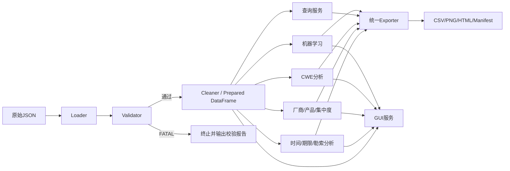

# 总体架构

## 1. 分层

## 2. 模块依赖规则

- 分析模块只能依赖`models/constants/errors`与prepared DataFrame；
- 分析模块之间不得互相读取对方导出的CSV；
- GUI调用服务函数，不读取分析模块输出作为唯一数据源；
- Exporter不参与指标计算；
- `main.py`只编排，不包含业务公式；
- 机器学习模块不得反向改变必做分析结果。

## 3. 单一事实源

| 内容 | 唯一事实源 |
|---|---|
| 字段列表、正则和快照常量 | `src/kev_analysis/constants.py` |
| 函数签名 | `src/kev_analysis/*.py`与`docs/interface-contract.md` |
| 输出路径、列、排序 | `contracts/output_registry.yaml` |
| 配置默认值 | `config/default.yaml` |
| 错误码 | `src/kev_analysis/errors.py`与`docs/error-contract.md` |
| 需求覆盖 | `docs/requirements-traceability.md` |

## 4. 数据流约束

- Loader输出原始DataFrame；
- Validator不得改值；
- Cleaner生成prepared副本；
- 每个分析函数对prepared输入只读；
- GUI每次载入原始JSON后调用同一Loader、Validator、Cleaner；
- 输出只由Exporter写入。

## 5. GUI架构

- `app.py`：界面编排；
- `filter_kev`：题目指定核心查询；
- `filter_kev_extended`：GUI产品关键词扩展；
- 图表函数接收筛选后DataFrame并返回Figure；
- CSV下载使用统一序列化规则；
- 不在UI回调中重复实现统计公式。
