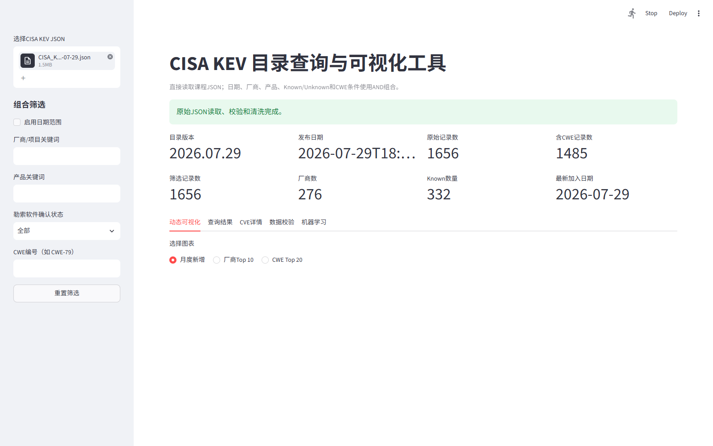

# 成员三章节：CWE多标签、组合查询与GUI

> 适用快照：`CISA_KEV_2026-07-29.json`。所有数字来自 `outputs/` 下正式产物。

## 1. CWE多标签结构与展开

`cwes` 是列表字段，一条CVE可以对应零个、一个或多个CWE。程序使用 `explode()` 建立CVE-CWE长表，并对同一CVE与同一CWE的关系去重。1,656条记录中，1,485条至少包含一个CWE，171条为空列表。空列表表示快照未提供对应CWE，不能填充为 `CWE-0` 或主观推测的类别。

总体CWE占比以1,485为分母：

\[
S_c=\frac{\#\{\text{包含CWE }c\text{ 的不同CVE}\}}{1485}
\]

由于CWE是多标签字段，各CWE占比之和可以超过100%。

## 2. CWE统计结果

| 排名 | CWE | 不同CVE数 | 占含CWE记录比例 |
|---:|---|---:|---:|
| 1 | CWE-20 | 118 | 7.95% |
| 2 | CWE-78 | 107 | 7.21% |
| 3 | CWE-787 | 100 | 6.73% |
| 4 | CWE-416 | 92 | 6.20% |
| 5 | CWE-119 | 84 | 5.66% |

Known且含CWE的记录有294条，Unknown且含CWE的记录有1,191条。子集统计必须分别使用294和1,191作为分母。Known子集中CWE-20与CWE-22均为25条，占8.50%；Unknown子集中CWE-78为95条，占7.98%。这些差异只描述当前快照标签结构，不能解释为某类CWE导致勒索软件利用。

数据来源：`cve_cwe_long.csv`、`cwe_overall_summary.csv`、`cwe_known_summary.csv`、`cwe_unknown_summary.csv`。


## 3. 组合查询函数

题目指定接口为：

```python
filter_kev(
    df,
    start_date=None,
    end_date=None,
    vendor=None,
    ransomware=None,
    cwe=None,
)
```

查询规则如下：

- 日期作用于 `dateAdded` 闭区间；
- 厂商对 `vendor_clean` 执行不区分大小写的字面子串匹配；
- `ransomware` 只接受 `Known`、`Unknown` 或 `None`；
- CWE先去除首尾空格并转大写，再校验 `^CWE-[0-9]+$`，最后在列表成员中精确匹配；
- 多个非空条件使用AND组合；
- 查询不原地修改输入DataFrame；
- 结果按 `dateAdded` 降序、`cveID` 升序稳定排序；
- 空结果保留完整列结构，摘要计数为0，最大日期为缺失值。

GUI需要产品关键词，因此使用 `filter_kev_extended()` 在核心查询之后增加 `product_clean` 字面子串条件，不改变题目指定函数签名。

## 4. 查询案例

| 案例 | 参数 | 记录数 | 厂商数 | Known数 | 最大日期 |
|---:|---|---:|---:|---:|---|
| 1 | 2022年、Microsoft、Known | 51 | 1 | 51 | 2022-12-13 |
| 2 | Microsoft、CWE-119 | 34 | 1 | 4 | 2022-06-08 |
| 3 | 2022年、Unknown、CWE-119 | 60 | 13 | 0 | 2022-09-15 |

程序不仅导出案例摘要，还分别导出三组实际记录到 `query_case_1.csv`、`query_case_2.csv` 和 `query_case_3.csv`。

## 5. GUI设计与实现

GUI使用Streamlit构建，直接读取用户上传的课程原始JSON，不使用 `kev_prepared.csv` 作为上传输入。上传后依次调用公共Loader、Validator和Cleaner，因此GUI与命令行流水线共享同一数据语义。

主要功能包括：

1. 展示目录版本、发布日期、原始记录数、含CWE记录数和加载状态；
2. 按日期、厂商、产品、Known/Unknown和CWE组合筛选，并支持重置；
3. 动态更新月度新增、厂商Top 10和CWE Top 20图；
4. 展示CVE结果表和漏洞描述、处置措施、期限及备注详情；
5. 导出当前筛选结果CSV和当前图表PNG；
6. 展示数据校验结果；
7. 展示预生成的TF-IDF与KMeans聚类摘要、关键词、记录和二维图。




第二张截图使用 `vendor=Microsoft`、`ransomware=Known`、`cwe=CWE-119`，得到4条记录，说明多条件AND逻辑已经在GUI中生效。

## 6. 参数校验与异常处理

查询层对开始日期晚于结束日期、非法状态、非法CWE格式、Prepared字段缺失以及CWE列非列表等情况抛出明确的业务异常。GUI捕获这些异常并显示用户可理解的错误信息。合法的空查询不是异常，界面仍显示完整结构并禁用无数据导出。

## 7. 正确性与局限

测试覆盖日期闭区间、单边日期、厂商大小写、非法状态、CWE规范化、精确成员匹配、多条件AND、空结果、稳定排序和输入不变性。GUI通过HTTP和启动冒烟测试，并以真实JSON完成上传与筛选截图验证。

CWE标签来自本地快照，不代表完整漏洞分类；Unknown不是未利用证据；GUI展示的聚类是探索性文本分组，不是风险评分或攻击预测。
